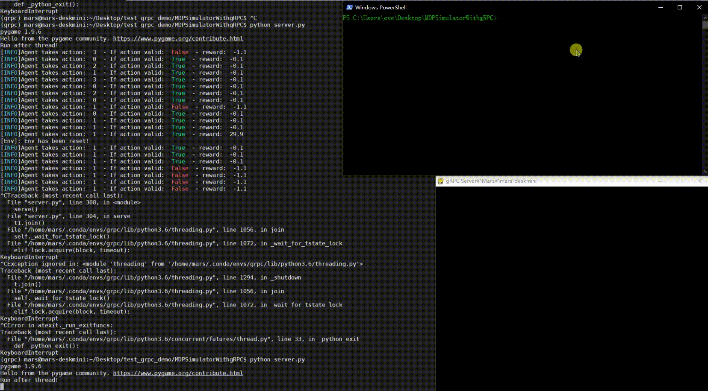
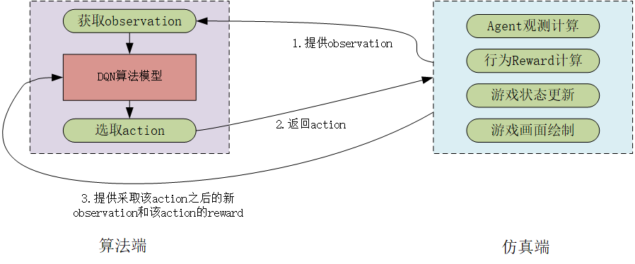

### 跨平台Agent仿真数据学习平台Simple Demo

---

#### 1. Introduction

该demo以**机器人找寻钻石**的简单故事为背景，搭建了一套基于**DQN**的学习系统，Agent通过不断在迷宫中尝试新的行为，不断总结经验最终学习会如何在最短路径下找到钻石，避开火堆，效果如下（图左为DQN算法程序学习迭代的过程，图右是仿真端程序根据算法端选择行为进行场景更新和效用计算的过程）：


在该Demo中，**仿真部分** 和 **算法部分** 采用**分布式部署**的设计模式，基于**gPRC**技术实现仿真端和算法端可以部署在不同的设备平台上，下图展示了分布式部署的功能，仿真端代码（即游戏场景）在Linux服务器上运行（图左），Agent算法在Windows的终端（图右上）中运行。Windows终端中显示的是算法端从仿真端获取的环境信息（Agent在游戏场景中的观测、行为回报等信息）：



该 Demo 设计框架如下，整个框架分为仿真端和算法端两大模块，仿真端负责运行并模拟整个游戏场景，包括Agent所需要的环境信息的计算、游戏场景状态如何根据Agent的行为决策进行更新、游戏画面绘制等；算法端负责根据一个Agent此刻的观测信息做出相应的行为决策，以及根据这个行为决策的回报效用来进行模型的自我更新和学习：



#### 2. Usage

* clone该项目并安装所需要的依赖包：

```bash
pip instasll -r requirements.txt
```

* 运行仿真端代码：

````bash
python server.py
````

* 运行算法端代码：

````bash
python client.py
````

> 分布式部署仿真和算法

如果希望将仿真端和算法端部署在不同的设备平台上，需要将两个不同的平台上都clone该项目，并修改算法端文件client.py中修改第17行代码：

```python
 	# 将'localhost:50051' 修改为仿真端机器的ip地址和端口，如: '192.168.0.102:50051'
    with grpc.insecure_channel('localhost:50051') as channel: 
        
        stub = envData_pb2_grpc.SimulatorStub(channel)
        ...
```

修改完成后再参照上面两行命令先后运行仿真端代码和算法端代码。

> 修改游戏地图

如果你希望更改地图的大小（添加障碍物、添加钻石、添加道路或是添加火焰），只需要修改仿真端代码sever.py第83行中的 `self.env_state` 这个变量即可：

````python
class Simulator(envData_pb2_grpc.Simulator):
    
    def __init__(self):

            """
               0 means normal road, 1 means gem(good destination), 
              -1 means fire(bad destination), 
              -2 means obstacle
            """
            self.env_state = [[0, 0, 0, 1],
                              [0, -2, 0, -1],
                              [0, 0, 0, -1]]
            self.initial_pos = [0, 2]  # at the third row, the frist column
````

